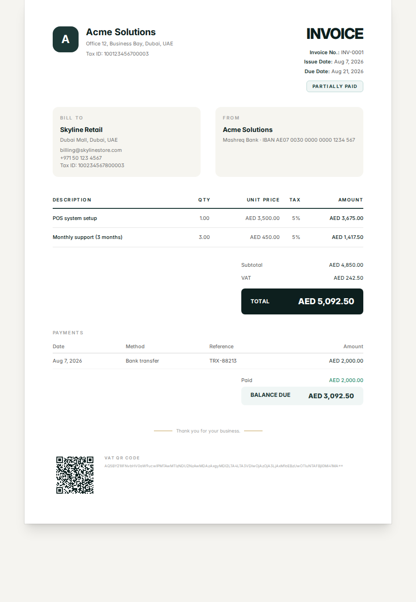
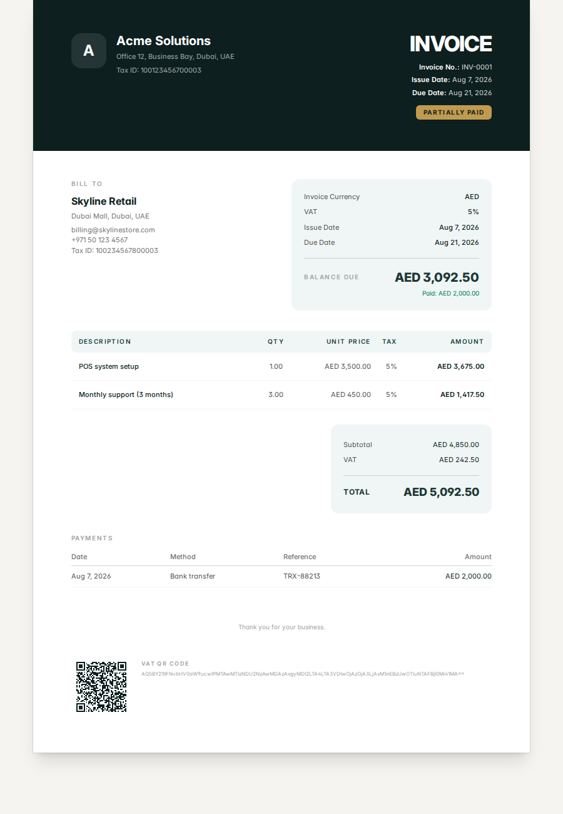
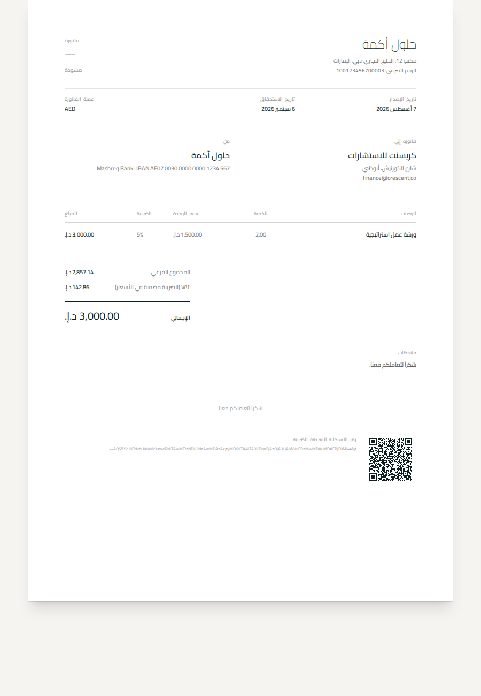
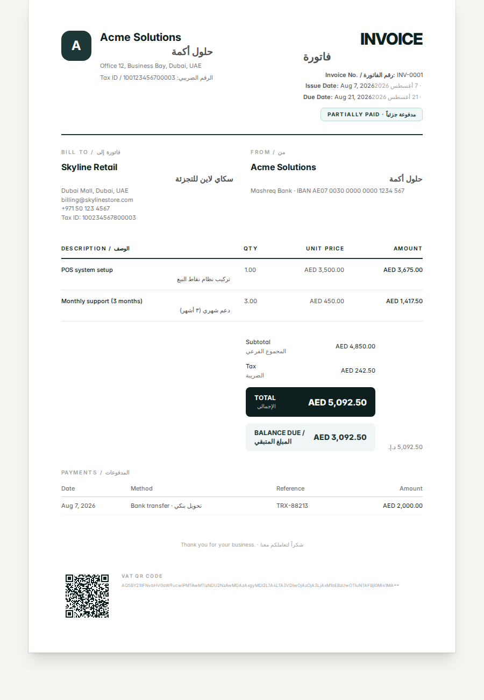

<div align="center">

<svg xmlns="http://www.w3.org/2000/svg" viewBox="0 0 32 32" width="56" height="56" fill="none">
  <rect x="1" y="1" width="30" height="30" rx="8" fill="#1d3836"/>
  <rect x="8" y="12" width="4.5" height="10" rx="1.25" fill="#f8f7f2"/>
  <rect x="14" y="8" width="4.5" height="14" rx="1.25" fill="#c09a4e"/>
  <rect x="20" y="15" width="4.5" height="7" rx="1.25" fill="#f8f7f2"/>
</svg>

# Bayanat — بينات

**Bilingual invoicing for Arabic and English.** Clients, invoices, quotes, payments, recurring billing, and pixel-perfect PDFs — in one workspace.

`Next.js 16` · `TypeScript` · `Prisma 7` · `Playwright` · `Tailwind CSS v4`

</div>

---

## ✨ Features

### Billing core
- **True bilingual documents** — one invoice, fully in English *or* Arabic (RTL), plus a **side-by-side bilingual** template showing both languages in a single PDF.
- **Four premium PDF templates** — *Classic*, *Modern*, *Minimal*, and *Bilingual* — selectable per invoice, default set at the organization level.
- **Gap-free invoice numbering** — drafts have no number; sending (or the recurring generator) reserves the next one inside a transaction. Numbers are never reused.
- **Partial payments & derived statuses** — `draft → sent → partially_paid → paid`, plus automatic `overdue`. The PDF shows payment history and the balance due.
- **Quotes** — create a quote with its own validity date, convert it to an invoice (payments unlock) or back.
- **Configurable tax** — name, rate, and inclusive *or* exclusive, per organization, per invoice, even per line item. VAT IDs print on the document.
- **VAT e-invoicing QR** — a GCC/ZATCA-compatible QR code (TLV base64) is embedded on every invoice that has a VAT ID.

- **Credit notes** — issue a credit against any paid invoice; it creates a numbered credit-note document and reduces the invoice balance.
- **Product catalog** — save reusable line items with prices and add them to invoices in one click.
- **Reports & exports** — VAT summary by rate/period, plus invoices/payments/clients/statement CSV exports.
- **Notifications** — in-app bell for invoice sent, payment received, signed, invites, and recurring generation.
- **Audit log** — a record of who changed what (admin view).
- **Multiple companies** — one account, switch between companies and create new ones.

### Workflow & collaboration
- **Shareable links & email delivery** — one click generates a signed 90-day link; with SMTP configured, the PDF is emailed to the client with the link. Clients can view/download without an account.
- **Recurring invoices** — repeat any sent invoice (weekly/monthly/quarterly/yearly); a cron endpoint generates due invoices automatically with gap-free numbers.
- **Team & roles** — invite members (admin/accountant/viewer), manage roles, and change your password.
- **Client-aware defaults** — selecting a client auto-fills currency, language, and due date from their payment terms.
- **Search & pagination** on invoices and clients.
- **Hijri dates** on documents, eastern (١٢٣) or western (123) digits.
- **Dashboard reporting** — outstanding, overdue, monthly invoiced/collected, and aging by client.

## 🖼️ Template gallery

| Classic | Modern | Minimal | Bilingual |
| :---: | :---: | :---: | :---: |
| Traditional ledger | Branded band, boxed totals | Editorial whitespace | English + Arabic together |
|  |  |  |  |

> The screen preview, the print view, and the downloaded PDF all come from the **same React component** — they can never drift.

## 🎨 Brand

- **Ink** — petrol teal `#1d3836` / `#0d1f1e`
- **Accent** — warm gold `#c09a4e`
- **Paper** — warm white `#f8f7f2`
- **Type** — Inter (Latin) + Cairo (Arabic), self-hosted and embedded in every PDF

## 🚀 Getting started

```bash
npm install
npx playwright install chromium        # PDF rendering engine
cp .env.example .env                   # set SESSION_SECRET, APP_ORIGIN, CRON_KEY
npm run db:migrate                     # apply Prisma migrations
npm run db:seed                        # optional demo workspace
npm run dev
```

Open [http://localhost:3000](http://localhost:3000) and create an account — signing up creates your organization and lands you on the dashboard.

**Demo seed login:** `admin@demo.com` / `password123`

## 🏗️ Architecture

- **One component, every output.** `components/invoice/InvoiceDocument.tsx` dispatches to the selected template and is rendered on the detail page, the standalone preview (`/invoices/[id]/pdf`), the public share page (`/share/[token]`), and by Playwright for every PDF download.
- **Templates as pure components.** `components/invoice/templates/*` share one typed data model — adding a template is one new file plus one entry in the dispatcher.
- **Integer money.** All monetary values are stored and computed as minor units (cents) via `lib/money.ts` — no floating-point money in calculations. Currency exponent (JPY 0, KWD 3, …) is handled automatically.
- **Signed share links.** `lib/share.ts` issues HMAC-signed tokens (90-day expiry) that grant read-only document access without a session.
- **Bilingual data model.** `name`/`nameAr` and `description`/`descriptionAr` live side by side; the invoice's `lang` (or the bilingual template) decides what's rendered.
- **Pooled PDF worker.** `lib/pdf.ts` reuses Chromium browsers across requests, and renders the app's own preview URLs — no separate HTML template to keep in sync.

```
app/
├── (auth)/                 login, signup, accept/[token] (invites)
├── (dashboard)/            dashboard, invoices, clients, recurring, settings, settings/team
├── invoices/[id]/pdf/      standalone PDF preview
├── share/[token]/          public client-facing view + PDF
└── api/
    ├── invoices/[id]/pdf/  authed Playwright download
    ├── share/[token]/pdf/  public Playwright download
    └── cron/recurring/     recurring-invoice generator (CRON_KEY)
components/
├── invoice/                types + 4 template components + QR/Hijri blocks
└── (forms, ui, nav…)       app UI
lib/
├── actions/                server actions (auth, clients, invoices, settings, team, recurring)
├── totals.ts, money.ts     integer money math + derived statuses
├── pdf.ts                  pooled Playwright worker
├── vat.ts                  VAT TLV + QR
├── share.ts, mail.ts       signed links + nodemailer SMTP
└── i18n.ts, format.ts      translations + locale/number formatting
```

## 🔧 Environment variables

| Variable | Description |
| --- | --- |
| `DATABASE_URL` | SQLite file path (or Postgres connection string) |
| `SESSION_SECRET` | Long random string — signs session JWTs and share links |
| `APP_ORIGIN` | Public origin the PDF worker uses to reach the app |
| `CRON_KEY` | Secret required by `/api/cron/recurring` |
| `SMTP_HOST` / `SMTP_PORT` / `SMTP_USER` / `SMTP_PASS` / `SMTP_SECURE` / `SMTP_FROM` | Optional SMTP for emailing invoices and invites |
| `NEXT_SERVER_ACTIONS_ENCRYPTION_KEY` | Optional; stable key for multi-instance deployments |

## 📜 Scripts

| Script | Purpose |
| --- | --- |
| `npm run dev` | Dev server with hot reload |
| `npm run build` / `start` | Production build & serve |
| `npm run lint` | ESLint |
| `npm run typecheck` | `tsc --noEmit` |
| `npm test` | Vitest unit tests (money, status, formatting) |
| `npm run db:migrate` | Apply Prisma migrations |
| `npm run db:seed` | Seed a demo workspace |
| `npm run test:e2e` | Core end-to-end flow (start dev server first) |
| `npm run test:e2e:growth` | Quotes/share/recurring/team end-to-end flow |

## ☁️ Deployment notes

- **Not serverless-friendly.** PDF generation launches Chromium, so run this on a small Node service (or a dedicated PDF worker) and point `APP_ORIGIN` at the public origin.
- Add two cron jobs:
  - Recurring generator: `curl -fsS "https://your-domain/api/cron/recurring?key=$CRON_KEY"` daily
  - Backups: `node scripts/backup.mjs --keep 14` nightly (retains DB + uploaded logos)
- Set a strong `SESSION_SECRET` and `CRON_KEY`. For multi-instance deploys, also set `NEXT_SERVER_ACTIONS_ENCRYPTION_KEY`.
- Configure `SMTP_HOST`/`SMTP_USER`/`SMTP_PASS` to enable emailing invoices, invites, and password resets.
- Login and signup are rate-limited in-memory (fine for a single instance; swap for a shared store if you scale).
- Password changes and resets revoke all previous sessions; security headers (CSP, HSTS, X-Frame-Options) are applied; a `/api/health` endpoint is available; set `SENTRY_DSN` to enable error reporting.
- SQLite is for local dev; swap the Prisma `datasource` to Postgres and re-migrate for a production-grade multi-tenant setup.

---

<div align="center">
Bayanat · بينات — <em>clean invoicing, in both languages.</em>
</div>
